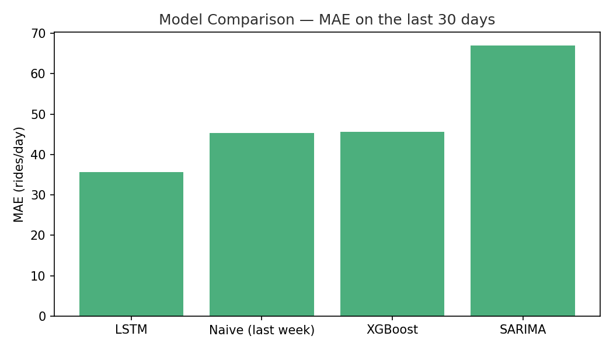
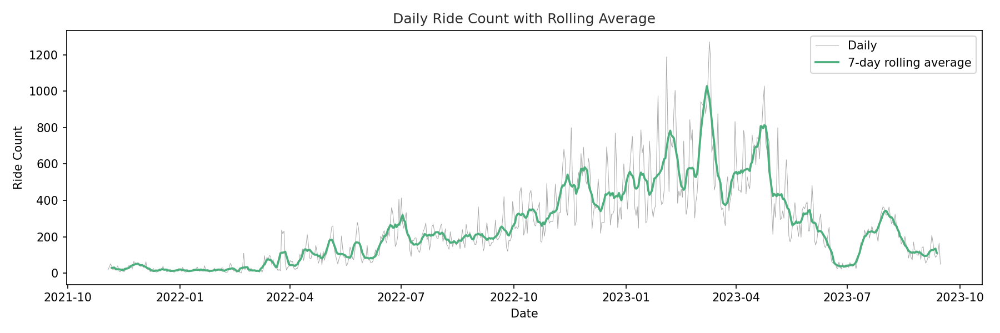
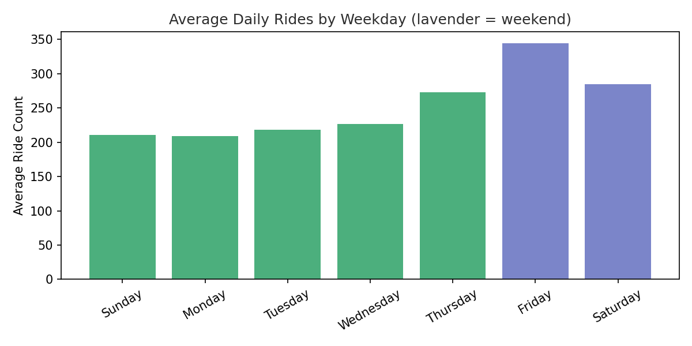

# Micromobility Demand Prediction System

A daily demand forecasting pipeline for Spiders Mobility, a Middle Eastern
micromobility (e-scooter) operator. Predicts daily ride demand from ~180K
raw ride records so the company can plan fleet allocation instead of
reacting to oversupply/undersupply after the fact.

This is an independent, professionally-restructured rebuild of an earlier
senior graduation project ("Demand Prediction for Micromobility in Spiders
Mobility", University of Jeddah), built from scratch with a proper
package structure, a fair chronological evaluation protocol, and honest
reporting of what worked and what didn't.

## Problem

Spiders Mobility could not reliably predict daily customer demand, leading
to financial losses from over- or under-supplying scooters across zones.
This project builds and compares three forecasting approaches — XGBoost,
SARIMA, and LSTM — to find the most reliable one.

## Results

All three models were evaluated on the **same held-out 30-day window**
(2023-08-17 → 2023-09-15), against a naive "same weekday last week"
baseline:

| Model | MAE | RMSE | R² |
|---|---|---|---|
| **LSTM** | **~33-36** | **~43-44** | **~-0.15 to -0.19** |
| Naive baseline | 45.4 | 59.0 | -1.13 |
| XGBoost | 45.6 | 57.6 | -1.03 |
| SARIMA | 67.0 | 75.2 | -2.46 |

(LSTM's exact numbers vary slightly run to run — neural network training has
some inherent randomness even with a fixed seed. Re-run `src/evaluation.py`
for the latest numbers; it consistently comes out on top.)

**Recommendation: deploy LSTM.** It's the only model that clearly beats
the naive baseline (~28% lower error); XGBoost roughly ties it, and SARIMA
underperforms it. All R² values are negative because the test window
falls right after a sharp demand drop the models had never seen during
training — see [Limitations](#limitations).



## Key findings from the data

- **Strong weekly seasonality**: Friday/Saturday (the Saudi weekend)
  average 38% more rides than weekdays.
- **Growth then reversal**: demand grew steadily from launch (Nov 2021)
  to a peak around Feb–Apr 2023, then dropped sharply — a regime change
  no model could have anticipated from historical data alone.
- **106 raw `Zone` values** were consolidated into 12 coarse regions via
  keyword matching (see `src/feature_engineering.py`); ~2% of rides came
  from internal/test zones (`Storage`, `Formula G1`, etc.) that don't
  represent real customer locations but were kept in the data per project
  decision.




## Project structure

```
micromobility-demand-prediction/
├── data/
│   ├── raw/                    # RidesDetails.csv — untouched original export
│   └── processed/              # cleaned + feature-engineered outputs
├── notebooks/                  # exploration only — logic graduates into src/
├── src/
│   ├── config.py                # paths, constants, column names
│   ├── utils.py                 # shared chronological train/test split
│   ├── preprocessing.py         # raw CSV -> cleaned rides
│   ├── feature_engineering.py   # Zone -> Region, Is_Weekend
│   ├── demand_dataset.py        # ride-level -> daily demand series
│   ├── eda.py                   # exploratory stats + first-look chart
│   ├── visualization.py         # presentation-ready charts
│   ├── xgboost_model.py
│   ├── arima_model.py
│   ├── lstm_model.py
│   ├── evaluation.py            # cross-model comparison table
│   └── predict.py               # 14-day future forecast
├── models/                      # trained model artifacts (.pkl / .keras)
├── outputs/
│   ├── figures/                 # saved charts
│   └── predictions/             # model_comparison.csv, future_predictions.csv
├── dashboard/                   # Tableau Public blueprint (see dashboard/README.md)
├── requirements.txt
└── main.py
```

## Setup

```bash
python3 -m venv .venv
source .venv/bin/activate
pip install -r requirements.txt
```

Place the raw export at `data/raw/RidesDetails.csv` (semicolon-separated,
`cp1256` encoding — see `src/config.py`).

## Running the pipeline

```bash
python3 -m src.preprocessing        # raw -> data/processed/rides_clean.csv
python3 -m src.feature_engineering  # adds Region, Is_Weekend
python3 -m src.demand_dataset       # ride-level -> data/processed/daily_demand.csv
python3 -m src.eda                  # summary stats + outputs/figures/eda_daily_trend.png
python3 -m src.visualization        # weekday/monthly/rolling-average charts
python3 -m src.evaluation           # trains all 3 models, writes the comparison table
python3 -m src.predict              # 14-day forecast -> outputs/predictions/future_predictions.csv
```

## Data

Raw dataset: `RidesDetails.csv` from Spiders Mobility — 180,030 rides,
6 columns (`RideId`, `Ride_Start_Time`, `Ride_End_Time`, `Zone`, `Customer`,
`Total_Time`), spanning 2021-11-03 to 2023-09-15 with no missing days.
`Customer` is dropped during preprocessing (inconsistent, not needed for
aggregate demand). Outliers in `Total_Time` are removed via the IQR method.

## Limitations

- All R² scores are negative on the 30-day test window because it sits
  right after an unprecedented demand drop — no model can predict a
  structural break it never saw in training. MAE/RMSE against the naive
  baseline are the more meaningful comparison here.
- No external features (weather, local events, pricing changes) — the
  April 2023 demand drop's cause is unknown from this data alone.
- ~2% of rides fall in an "Other" region because their Zone name doesn't
  match any known city keyword.

## Future work

- Investigate the April 2023 demand drop with the business (pricing?
  reduced zone coverage?) before trusting long-horizon forecasts.
- Add weather and local event data.
- Re-run with a full year-over-year comparison once more data accumulates,
  to separate genuine seasonality from the growth-trend confound noted in
  `src/visualization.py`.

## Credits

Rebuilt from the original senior project *"Demand Prediction for
Micromobility in Spiders Mobility"* (Ruba Alghamdi, Ghadeer Hamdi, Sadeel
Mirza; supervised by Dr. Safa Habibullah; University of Jeddah), with data
provided by Spiders Mobility.
